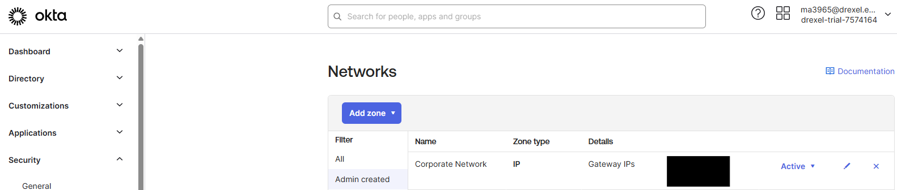
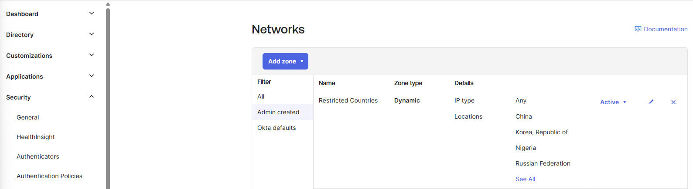
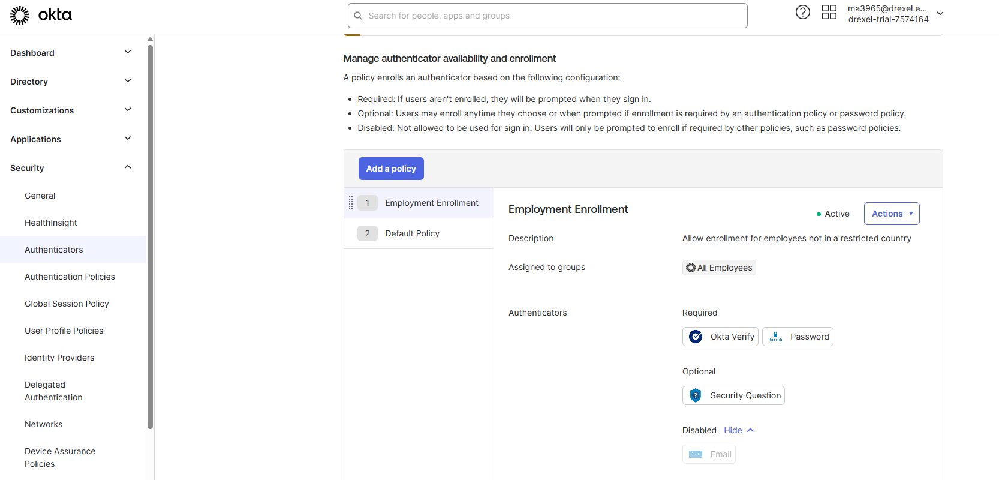
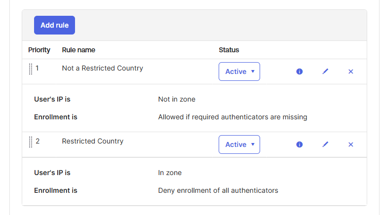
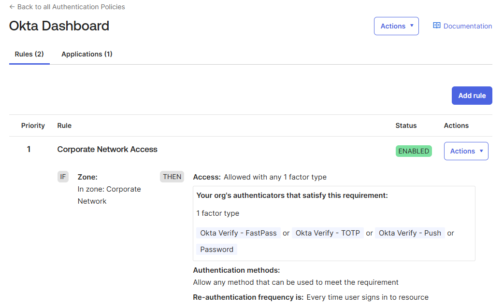
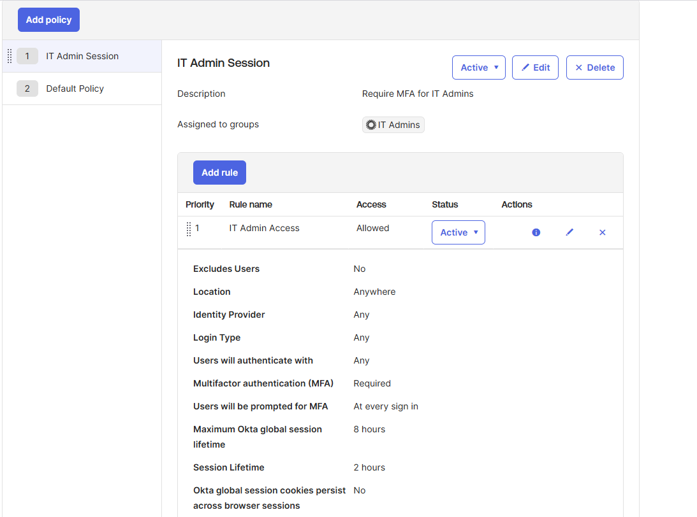
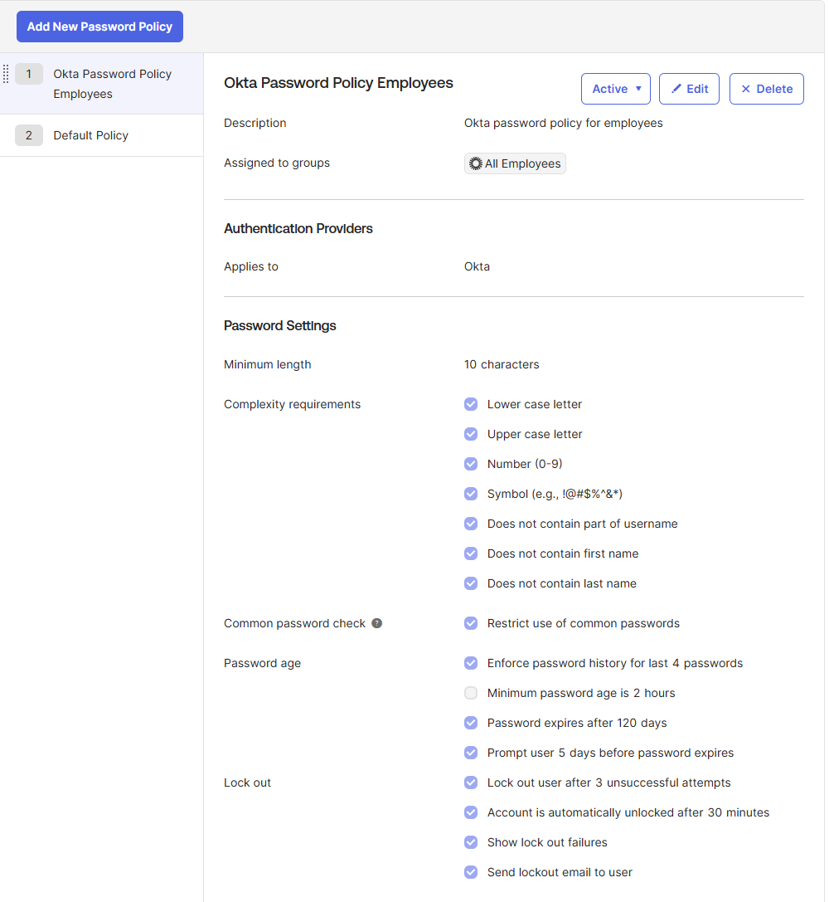
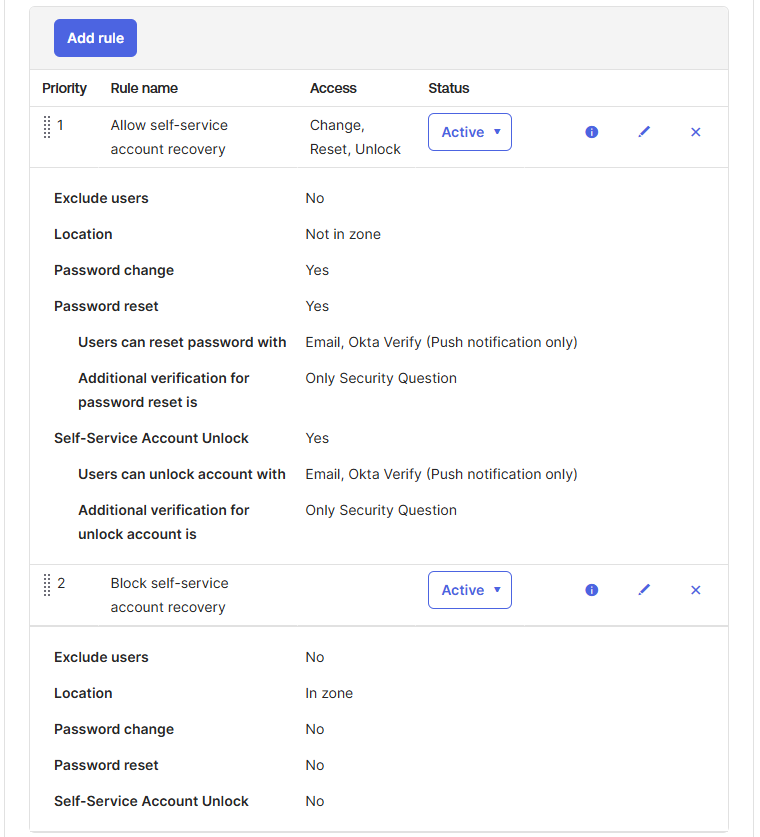

# 🔐 Implementing Security Policies in Okta

This lab covers advanced security configurations using **Okta’s policy engine**, including IP zones, dynamic location-based access, MFA enforcement, global session restrictions, and password policy rules.

---

## 🎯 Lab Objectives

- Define trusted and restricted network zones
- Enforce MFA with contextual policies
- Create session rules for IT admins
- Design a password policy with recovery controls
- View authentication and policy evaluation logs

---

## 🔹 Lab Activities

### 🌐 1. Add an IP Network Zone

**Goal**: Create a trusted **Corporate Network** zone using your current gateway IP.

📸 Screenshot:  

---

### 🌍 2. Add a Dynamic Zone for Restricted Countries

**Goal**: Block access from restricted geographies (e.g., Wallis and Futuna)

📸 Screenshot:  

---

### 🔐 3. Configure MFA Enrollment Policy

**Goal**: Require MFA for users **not in restricted countries**. Block enrollment for restricted zones.

- Okta Verify: Required  
- Security Question: Optional  
- Email: Disabled

📸 Screenshot:  

📸 Screenshot:  

---

### 👨‍💻 4. Add a Rule to Okta Dashboard Authentication Policy

**Goal**: Allow access to the dashboard using **any 1 factor** from the Corporate Network.

📸 Screenshot:  

---

### 🕒 5. Set Up a Global Session Policy

**Goal**: Require MFA for all **IT Admins** at every login with session timeout settings.

- Session lifetime: 8 hours  
- Idle timeout: 2 hours

📸 Screenshot:  

---

### 🔑 6. Set Up a Password Policy

**Goal**: Enforce strong password requirements for all employees and control self-service recovery based on location.

- Min length: 10 characters  
- Complexity: All enabled  
- Lockout after 3 attempts

📸 Screenshot:  

📸 Screenshot:  

---

## 🧪 Logs and Testing

Throughout the lab, system logs were reviewed to verify:

- MFA authentication success
- Policy rule evaluation (IP zone, session, and authenticator rules)
- Password lockout and recovery attempts

📸 Screenshot:  

---

## ✅ Skills Demonstrated

- 📍 IP & Dynamic Network Zone Management
- 🛡️ MFA Enrollment and Restriction
- 🔁 Session Policies and Timed Access
- 🔐 Password Complexity & Lockout Enforcement
- 📊 Log Analysis for Policy Evaluation

---

## 📎 Related Labs

- 🧑‍💼 [User Definition & Role Assignment](https://github.com/markwhyce-svg/okta-user-management-lab)
- 👥 [Organizing Users with Groups](https://github.com/markwhyce-svg/okta-organize-users-lab)

---

> 🔧 Built as part of my Identity & Access Management (IAM) journey using Okta — by [Michael Akintuyosi](https://www.linkedin.com/in/michael-akintuyosi-025317183/)
